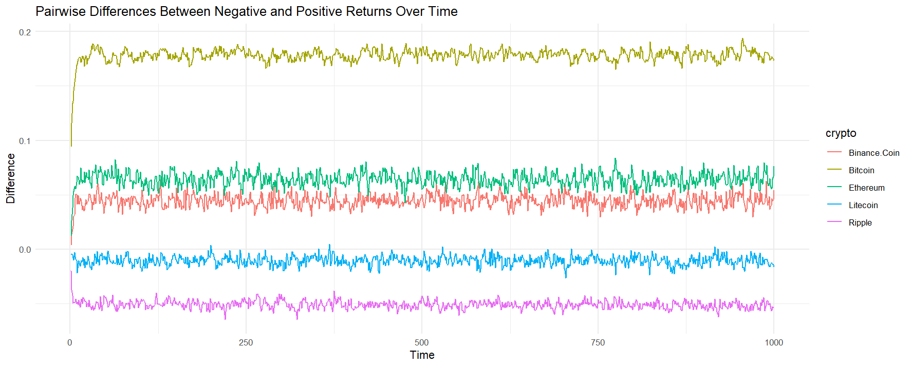

# Assessing the Performance of Cryptocurrencies Using the Two-Type Branching Process in a Random Environment

## Project Overview

This project investigates the performance of five major cryptocurrencies (Binance Coin, Bitcoin, Ethereum, Litecoin, and Ripple) over a six-year period (2018-2023). The analysis utilizes daily price data to evaluate positive and negative returns using thresholds of 0.02 and -0.02, respectively. A two-type branching process in a random environment is employed to model and analyze the performance.

## Key Features

### 1. **Pairwise Differences in Returns**

The first visualization depicts the differences between negative and positive returns over time for each cryptocurrency. Key observations include:

- **Bitcoin** exhibits the highest variance and overall difference, indicating larger fluctuations in positive versus negative returns.
- **Binance Coin** and **Ethereum** display moderate differences, suggesting relatively stable performance with occasional spikes.
- **Litecoin** and **Ripple** have the smallest differences, reflecting consistent behavior with fewer significant return disparities.

### 2. **Limit Distribution in Random Environment**

The second visualization showcases the limit distribution of the difference in negative and positive returns. Probabilities for the random environment are weighted based on historical data:

- **2018-2019**: Initial probabilities.
- **2020-2021**: Increased weight to reflect more recent trends.
- **2022-2023**: Highest weight to emphasize current market conditions.
  This weighting approach highlights the evolving market behavior and its influence on return patterns.

## Usage

1. Clone the repository.
2. View the visualizations embedded below.
3. Run the provided scripts to replicate or extend the analysis.

## Conclusion

This project demonstrates how branching processes and random environments can provide unique insights into cryptocurrency performance. By leveraging weighted historical data, it offers a nuanced perspective on market trends and return dynamics.

---

### Visualizations:

1. **Pairwise Differences Between Negative and Positive Returns Over Time**  
   
)

2. **Limit Distribution in Random Environment**  
   
